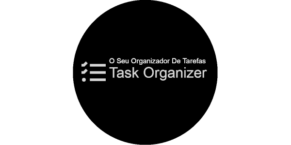

# Ebytr - Task Organizer

Um sistema capaz de auxiliar as pessoas colaboradoras a se organizar e ter mais produtividade.




## Funcionalidades

- Você pode Visualizar sua lista de tarefas.
- Ordenar por alfabética, data de criação ou por status.
- Você será capaz de inserir uma nova tarefa na lista.
- Remover uma tarefa da lista.
- Atualizar uma tarefa da lista
- Muda os Status da tarefa pra `Pendente`, `Em andamento` ou `Pronto`

## Como o Projeto.

Clone o projeto:
```bash
  git clone git@github.com:rogeriop1990cv/ebytr-task-organizer.git
```
Depois entre do diretoria que foi criado.
```bash
  cd ebytr-task-organizer
```

Instale as dependencias:
```bash
  npm install
```  

Inicie o servidor backend
!!! Sem o backend a aplicação não funciona corretamente
```bash
  npm run start -w backend
```
Inicie o servidor frontend
```bash
  npm run start -w frontend
```

## Documentação da Api Task Organizer

[Api Task Organizer - Backend](https://github.com/rogeriop1990cv/ebytr-task-organizer/tree/master/backend)
